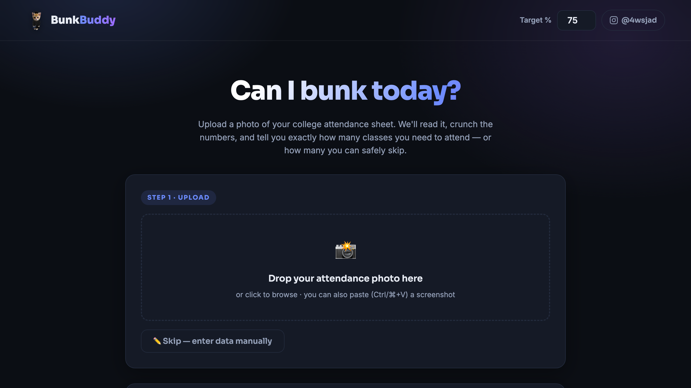
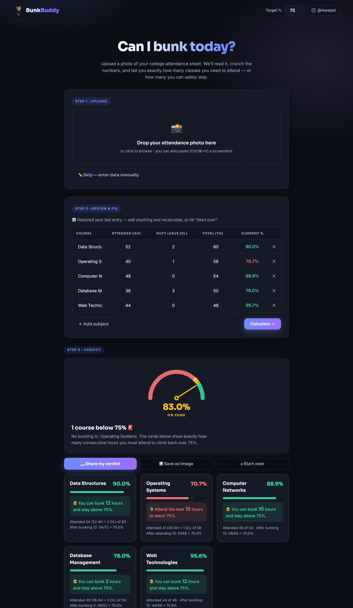

# 🎓 Bunk Buddy — Attendance Calculator

**Can I bunk today?** Upload a photo of your college attendance report and Bunk Buddy reads it, crunches the numbers, and tells you exactly how many classes you can safely skip — or how many you need to attend — to stay above 75%.

🔗 **Live app:** https://attendence-calculator-4wsjad.web.app
📸 **Made for college students** who live on the edge of the attendance cutoff.

> ⚖️ *Strictly for educational purposes — the education being math. The developer officially recommends attending every single class. What you do with the math is between you and your hall ticket.*

---




---

## What it does

You give it a screenshot/photo of your **Course Wise Attendance Report**. It:

1. **Reads the table** straight from the image using in-browser OCR.
2. **Extracts** each course's hours: **TH** (total held), **AH** (attended), and **DL** (duty leave).
3. **Calculates** your effective attendance as `(AH + DL) / TH` per course.
4. **Tells you the verdict** for every subject:
   - 😎 *"You can bunk 6 hours and stay above 75%"*
   - 📚 *"Attend the next 5 hours to reach 75%"*
   - ⚠️ *"Right on the edge — don't miss the next class"*

No typing required — though you can always edit the numbers or enter them by hand.

## How it works

### Reading the image (OCR)
Everything runs **in your browser** with [Tesseract.js](https://tesseract.projectnaptha.com/) — your photo never leaves your device. The hard part of a real college report isn't reading text, it's reading a *table*, so the pipeline does a few things:

- **Pre-processing:** the image is upscaled, contrast-stretched, and adaptively binarized so phone photos in bad lighting still read cleanly.
- **Grid-line removal:** long horizontal/vertical ink runs (table borders) are erased before OCR, which otherwise wrecks Tesseract's layout detection.
- **Positional parsing:** instead of reading flat text, it uses each word's bounding box to map numbers to the right column. It handles both row-label and column-header table layouts, multi-line wrapped course names, and skips the `TOTAL` summary row.
- **Self-correction:** it cross-checks `AH` against the report's own `AH+DL` and percentage columns to recover digits the OCR dropped, and rebuilds `TH` from the percentage if that column is unreadable.
- **Junk rejection:** if you upload a random screenshot (a chat, a meme), it's scored against attendance-report keywords and politely rejected instead of inventing numbers.

### The math
For a target fraction `p`, effective attended `a = AH + DL`, total `t = TH`:

- **Classes you must attend** to reach the target: `x = ⌈(p·t − a) / (1 − p)⌉`
- **Classes you can bunk** while staying above it: `y = ⌊a/p − t⌋`

## Features

- 📷 **Photo / screenshot / paste** — drop a file, browse, or `Ctrl/⌘+V` a screenshot
- ✏️ **Manual entry & editing** — fix any OCR mistake before calculating
- 🎯 **Adjustable target %** (defaults to 75)
- 📊 **Bunk-o-meter gauge**, animated per-course meters, and a sorted comparison chart
- 📤 **Shareable verdict image** — export a clean summary card for your Instagram story or the group chat
- 💾 **Remembers your last entry** (localStorage) and restores it on reopen
- 📱 **Installable PWA** — "Add to Home Screen", works fully offline after the first visit
- 🎲 **20 attendance fun facts** because why not

## Tech stack

Pure static site — no build step, no backend.

- **HTML / CSS / vanilla JavaScript**
- **[Tesseract.js](https://github.com/naptha/tesseract.js)** for in-browser OCR (via CDN)
- **Canvas** for image pre-processing and the shareable verdict card
- **Service Worker + Web App Manifest** for offline / installable PWA
- **Firebase Hosting** for deployment

## Privacy

100% client-side. Your attendance image is processed entirely in your browser and is **never uploaded to any server**.

## Run locally

It's a static site — any HTTP server works:

```bash
# from the project folder
python3 -m http.server 4173
# then open http://localhost:4173
```

## Deploy

Hosted on Firebase. To redeploy:

```bash
firebase deploy --only hosting
```

> **Note on caching:** assets are cache-busted with a `?v=N` query. When you change `script.js` or `style.css`, bump that `N` in `index.html` **and** the `bunkbuddy-vN` cache name in `sw.js` together, so browsers and the service worker pick up the new version.

## Project structure

```
index.html        — markup
style.css         — styling
script.js         — OCR pipeline, table parsing, the math, UI
sw.js             — service worker (offline app shell)
manifest.webmanifest
logo.png          — graduation-cat logo
icon-*.png        — PWA icons
make-icons.js     — one-off icon generator (dev only)
process-logo.js   — one-off logo background-removal (dev only)
```

---

Built by [@4wsjad](https://www.instagram.com/4wsjad) 🐱🎓
